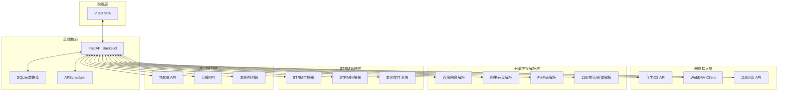
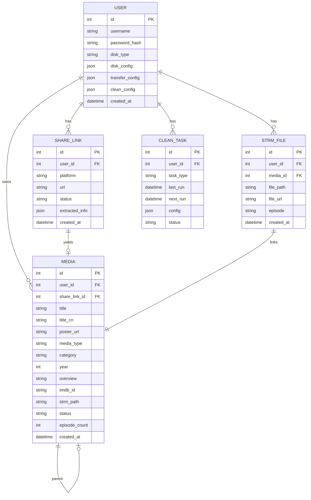
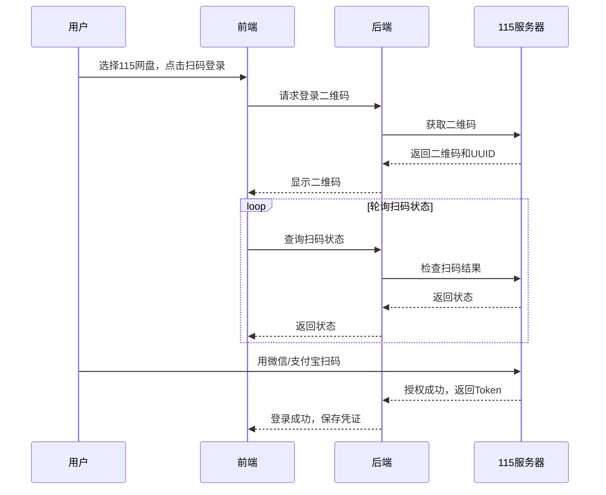
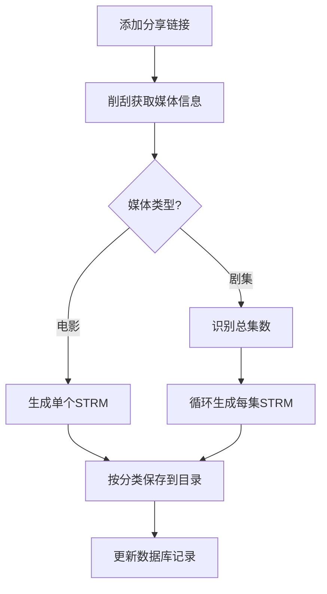
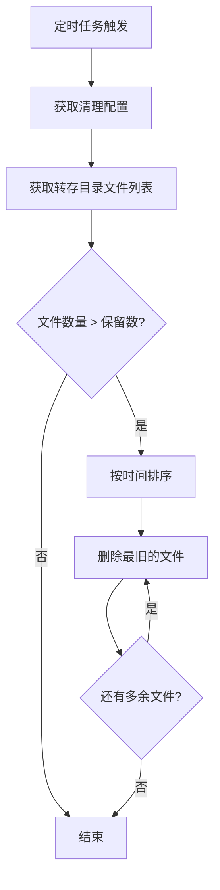

# 技术设计文档 - fnnas-media-hub v2

## 1. 概述

**项目名称**: fnnas-media-hub  
**功能**: 私有云盘媒体中心 - 支持多网盘登录、分享链接削刮、STRM文件管理、自动分类  
**目标用户**: 私有NAS用户（飞牛OS等）

## 2. 系统架构



## 3. 数据库模型更新

### 3.1 ER图



### 3.2 数据表定义

```sql
-- 用户表（含配置）
CREATE TABLE users (
    id INTEGER PRIMARY KEY AUTOINCREMENT,
    username VARCHAR(100) NOT NULL UNIQUE,
    password_hash VARCHAR(255) NOT NULL,
    disk_type VARCHAR(50) NOT NULL,
    disk_config TEXT,
    transfer_config TEXT,
    clean_config TEXT,
    created_at TIMESTAMP DEFAULT CURRENT_TIMESTAMP
);

-- 分享链接表
CREATE TABLE share_links (
    id INTEGER PRIMARY KEY AUTOINCREMENT,
    user_id INTEGER NOT NULL,
    platform VARCHAR(50) NOT NULL,
    url TEXT NOT NULL,
    status VARCHAR(20) DEFAULT 'pending',
    extracted_info TEXT,
    error_msg TEXT,
    created_at TIMESTAMP DEFAULT CURRENT_TIMESTAMP,
    FOREIGN KEY (user_id) REFERENCES users(id)
);

-- 媒体表
CREATE TABLE media (
    id INTEGER PRIMARY KEY AUTOINCREMENT,
    user_id INTEGER NOT NULL,
    share_link_id INTEGER,
    title VARCHAR(500) NOT NULL,
    title_cn VARCHAR(500),
    poster_url TEXT,
    media_type VARCHAR(20) NOT NULL,
    category VARCHAR(20) DEFAULT 'movie',
    year INTEGER,
    overview TEXT,
    tmdb_id VARCHAR(50),
    strm_path TEXT,
    status VARCHAR(20) DEFAULT 'pending',
    episode_count INTEGER DEFAULT 1,
    created_at TIMESTAMP DEFAULT CURRENT_TIMESTAMP,
    FOREIGN KEY (user_id) REFERENCES users(id),
    FOREIGN KEY (share_link_id) REFERENCES share_links(id)
);

-- STRM文件表
CREATE TABLE strm_files (
    id INTEGER PRIMARY KEY AUTOINCREMENT,
    user_id INTEGER NOT NULL,
    media_id INTEGER,
    file_path VARCHAR(1000) NOT NULL,
    file_url TEXT,
    episode VARCHAR(20),
    created_at TIMESTAMP DEFAULT CURRENT_TIMESTAMP,
    FOREIGN KEY (user_id) REFERENCES users(id),
    FOREIGN KEY (media_id) REFERENCES media(id)
);

-- 清理任务表
CREATE TABLE clean_tasks (
    id INTEGER PRIMARY KEY AUTOINCREMENT,
    user_id INTEGER NOT NULL,
    task_type VARCHAR(50) NOT NULL,
    last_run TIMESTAMP,
    next_run TIMESTAMP,
    config TEXT,
    status VARCHAR(20) DEFAULT 'idle',
    FOREIGN KEY (user_id) REFERENCES users(id)
);
```

## 4. API设计

### 4.1 Dashboard接口

| 方法 | 路径 | 描述 |
|------|------|------|
| GET | /api/v1/dashboard/stats | 获取统计数据 |
| GET | /api/v1/dashboard/recent | 获取最近添加 |
| GET | /api/v1/dashboard/storage | 获取存储状态 |

### 4.2 115登录接口

| 方法 | 路径 | 描述 |
|------|------|------|
| POST | /api/v1/auth/115/qrcode | 获取115登录二维码 |
| GET | /api/v1/auth/115/qrcode/{uuid} | 查询扫码状态 |
| POST | /api/v1/auth/115/logout | 登出115 |

### 4.3 STRM接口

| 方法 | 路径 | 描述 |
|------|------|------|
| POST | /api/v1/strm/generate/{media_id} | 生成STRM文件 |
| POST | /api/v1/strm/scan | 扫描本地STRM |
| GET | /api/v1/strm/list | 获取STRM列表 |
| DELETE | /api/v1/strm/{id} | 删除STRM文件 |

### 4.4 清理任务接口

| 方法 | 路径 | 描述 |
|------|------|------|
| GET | /api/v1/tasks/clean | 获取清理任务状态 |
| POST | /api/v1/tasks/clean | 创建清理任务 |
| PUT | /api/v1/tasks/clean/{id} | 更新清理任务 |
| POST | /api/v1/tasks/clean/{id}/run | 立即执行清理 |
| POST | /api/v1/tasks/clear-security | 清理115安全码 |

### 4.5 分类统计接口

| 方法 | 路径 | 描述 |
|------|------|------|
| GET | /api/v1/stats/media | 获取媒体统计 |
| GET | /api/v1/stats/by-category | 按分类统计 |

## 5. 核心模块设计

### 5.1 Dashboard服务

```python
class DashboardService:
    def __init__(self, db: Session):
        self.db = db
    
    async def get_stats(self, user_id: int) -> dict:
        movie_count = self.db.query(Media).filter(
            Media.user_id == user_id,
            Media.category == 'movie'
        ).count()
        
        tv_count = self.db.query(Media).filter(
            Media.user_id == user_id,
            Media.category == 'tv'
        ).count()
        
        anime_count = self.db.query(Media).filter(
            Media.user_id == user_id,
            Media.category == 'anime'
        ).count()
        
        variety_count = self.db.query(Media).filter(
            Media.user_id == user_id,
            Media.category == 'variety'
        ).count()
        
        return {
            "movie_count": movie_count,
            "tv_count": tv_count,
            "anime_count": anime_count,
            "variety_count": variety_count,
            "total": movie_count + tv_count + anime_count + variety_count
        }
```

### 5.2 115登录模块

```python
class115Client:
    def __init__(self):
        self.session = None
        self.uid = None
        self.token = None
    
    async def get_qrcode(self) -> dict:
        url = "https://passport.115.com/erweima/getdata/"
        params = {"app": "115"}
        async with httpx.AsyncClient() as client:
            response = await client.get(url, params=params)
            data = response.json()
            return {
                "uuid": data.get("uid"),
                "qrcode_url": data.get("qrcode"),
                "expires_in": 300
            }
    
    async def check_qrcode_status(self, uuid: str) -> dict:
        url = "https://passport.115.com/erweima/check/"
        params = {"uid": uuid}
        async with httpx.AsyncClient() as client:
            response = await client.get(url, params=params)
            data = response.json()
            return {
                "status": data.get("status"),
                "uid": data.get("uid"),
                "token": data.get("token")
            }
```

### 5.3 STRM生成器

```python
class STRMGenerator:
    def __init__(self, disk_client, fnnas_client):
        self.disk = disk_client
        self.fnnas = fnnas_client
    
    async def generate_strm(self, media: Media, episode: int = None) -> str:
        if media.share_link:
            file_url = await self.disk.get_share_file_url(
                media.share_link.url,
                media.share_link.get_extracted_info()
            )
        else:
            file_url = media.file_path
        
        file_name = self._generate_filename(media, episode)
        strm_content = f"#EXTM3U\n#EXTINF:-1,{media.title_cn or media.title}\n{file_url}"
        
        category_path = self._get_category_path(media.category)
        save_path = f"/media/{category_path}/{file_name}.strm"
        
        await self.fnnas.write_file(save_path, strm_content)
        
        return save_path
    
    def _generate_filename(self, media: Media, episode: int = None) -> str:
        title = re.sub(r'[<>:"/\\|?*]', '', media.title)
        if episode:
            return f"{title}/S01E{episode:02d}"
        elif media.year:
            return f"{title}/{title}.{media.year}"
        return title
    
    def _get_category_path(self, category: str) -> str:
        paths = {
            "movie": "电影",
            "tv": "剧集",
            "anime": "动漫",
            "variety": "综艺"
        }
        return paths.get(category, "其他")
```

### 5.4 定时清理任务

```python
class CleanScheduler:
    def __init__(self, db: Session):
        self.db = db
        self.scheduler = APScheduler()
    
    async def setup_task(self, user_id: int, config: dict):
        task = CleanTask(
            user_id=user_id,
            task_type="transfer_clean",
            config=json.dumps(config)
        )
        
        schedule_type = config.get("schedule_type", "daily")
        hour = config.get("hour", 3)
        
        if schedule_type == "daily":
            self.scheduler.add_job(
                self._clean_transfer_dir,
                "cron",
                hour=hour,
                args=[user_id]
            )
        elif schedule_type == "weekly":
            self.scheduler.add_job(
                self._clean_transfer_dir,
                "cron",
                day_of_week="sun",
                hour=hour,
                args=[user_id]
            )
    
    async def _clean_transfer_dir(self, user_id: int):
        user = self.db.query(User).filter(User.id == user_id).first()
        config = user.get_clean_config()
        keep_count = config.get("keep_count", 5)
        
        transfer_dir = config.get("transfer_dir", "/media/转存")
        files = await self.fnnas.list_files(transfer_dir)
        files.sort(key=lambda x: x.get("mtime", 0))
        
        if len(files) > keep_count:
            for f in files[:-keep_count]:
                await self.fnnas.delete_file(f.get("path"))
```

### 5.5 115安全码清理

```python
class SecurityCodeCleaner:
    def __init__(self, client: Client115):
        self.client = client
    
    async def clear_security_code(self) -> bool:
        try:
            url = "https://webapi.115.com/files/security"
            response = await self.client.request("GET", url)
            
            if "安全验证" in response.text:
                await self._auto_verify()
            
            return True
        except Exception as e:
            logger.error(f"Clear security code failed: {e}")
            return False
    
    async def _auto_verify(self):
        url = "https://webapi.115.com/files/security/verify"
        await self.client.request("POST", url, data={"verify_type": "auto"})
```

## 6. 前端页面结构

```
frontend/src/views/
├── Dashboard.vue      # 面板首页
├── Login.vue         # 登录页（含115扫码）
├── Home.vue           # 海报墙
├── AddLinks.vue       # 添加链接
├── MediaDetail.vue    # 媒体详情
├── Player.vue         # 播放页
└── Settings.vue       # 设置页
```

### 6.1 Dashboard页面布局

```vue
<template>
  <div class="dashboard">
    <a-row :gutter="24">
      <a-col :span="6">
        <a-statistic title="电影" :value="stats.movie_count" />
      </a-col>
      <a-col :span="6">
        <a-statistic title="电视剧" :value="stats.tv_count" />
      </a-col>
      <a-col :span="6">
        <a-statistic title="动漫" :value="stats.anime_count" />
      </a-col>
      <a-col :span="6">
        <a-statistic title="综艺" :value="stats.variety_count" />
      </a-col>
    </a-row>
    
    <a-row :gutter="24" class="mt-24">
      <a-col :span="12">
        <a-card title="存储状态">
          <a-progress :percent="storage.used_percent" />
          <p>{{ storage.used }} / {{ storage.total }}</p>
        </a-card>
      </a-col>
      <a-col :span="12">
        <a-card title="快捷操作">
          <a-space direction="vertical">
            <a-button @click="$router.push('/add-links')">添加链接</a-button>
            <a-button @click="handleScanSTRM">扫描STRM</a-button>
            <a-button @click="handleCleanTask">清理转存</a-button>
          </a-space>
        </a-card>
      </a-col>
    </a-row>
  </div>
</template>
```

## 7. 部署配置

### 7.1 docker-compose.yml 更新

```yaml
services:
  backend:
    build:
      context: ./backend
      dockerfile: Dockerfile
    ports:
      - "3000:3000"
    volumes:
      - ./data:/app/data
      - ./data/downloads:/app/downloads
      - ./data/strm:/app/strm
    environment:
      - DATABASE_URL=sqlite:///app/data/media.db
      - SECRET_KEY=${SECRET_KEY}
    restart: unless-stopped

  frontend:
    build:
      context: ./frontend
      dockerfile: Dockerfile
    ports:
      - "8080:80"
    restart: unless-stopped
```

## 8. 115网盘登录流程



## 9. STRM生成流程



## 10. 定时清理流程


