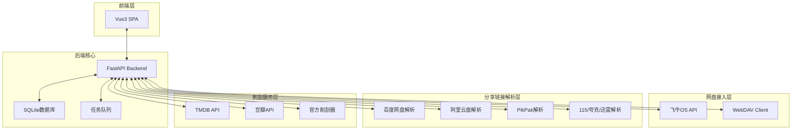
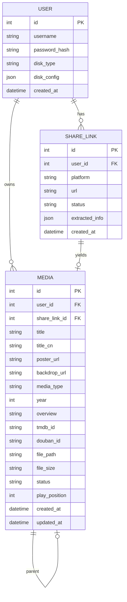

# 技术设计文档 - fnnas-media-hub

## 1. 概述

**项目名称**: fnnas-media-hub  
**功能**: 私有云盘媒体中心 - 支持多网盘登录、分享链接削刮、海报墙展示、一键转存播放  
**目标用户**: 私有NAS用户（飞牛OS等）

## 2. 系统架构



## 3. 技术架构详解

### 3.1 前端架构

```
frontend/
├── src/
│   ├── views/
│   │   ├── Login.vue           # 登录页
│   │   ├── Home.vue            # 海报墙首页
│   │   ├── AddLinks.vue        # 添加链接页
│   │   ├── MediaDetail.vue     # 媒体详情页
│   │   ├── Player.vue          # 播放页
│   │   └── Settings.vue        # 设置页
│   ├── components/
│   │   ├── MediaCard.vue       # 媒体卡片
│   │   ├── MediaGrid.vue       # 海报网格
│   │   ├── MediaSearch.vue     # 搜索组件
│   │   ├── TransferProgress.vue # 转存进度
│   │   └── VideoPlayer.vue     # 播放器组件
│   ├── stores/
│   │   ├── auth.ts             # 认证状态
│   │   ├── media.ts            # 媒体数据
│   │   └── settings.ts         # 设置状态
│   └── api/
│       ├── auth.ts             # 认证API
│       ├── media.ts            # 媒体API
│       └── scraper.ts          # 削刮API
```

### 3.2 后端架构

```
backend/
├── app/
│   ├── api/
│   │   ├── v1/
│   │   │   ├── auth.py         # 认证接口
│   │   │   ├── media.py        # 媒体接口
│   │   │   ├── scrape.py        # 削刮接口
│   │   │   ├── transfer.py     # 转存接口
│   │   │   └── player.py       # 播放接口
│   │   └── deps.py             # 依赖注入
│   ├── core/
│   │   ├── config.py          # 配置管理
│   │   ├── security.py        # 安全工具
│   │   └── database.py        # 数据库连接
│   ├── models/
│   │   ├── user.py            # 用户模型
│   │   ├── media.py           # 媒体模型
│   │   └── share_link.py      # 分享链接模型
│   ├── services/
│   │   ├── auth_service.py    # 认证服务
│   │   ├── media_service.py   # 媒体服务
│   │   ├── scrape_service.py  # 削刮服务
│   │   └── transfer_service.py # 转存服务
│   ├── spiders/
│   │   ├── tmdb.py            # TMDB削刮器
│   │   ├── douban.py          # 豆瓣削刮器
│   │   ├── baidu.py           # 百度网盘解析
│   │   ├── aliyun.py          # 阿里云盘解析
│   │   └── pikpak.py          # PikPak解析
│   └── main.py
```

## 4. 数据库模型

### 4.1 ER图



### 4.2 数据表定义

```sql
-- 用户表
CREATE TABLE users (
    id INTEGER PRIMARY KEY AUTOINCREMENT,
    username VARCHAR(100) NOT NULL UNIQUE,
    password_hash VARCHAR(255) NOT NULL,
    disk_type VARCHAR(50) NOT NULL,  -- 'fnnas', 'webdav'
    disk_config TEXT,  -- JSON: {host, port, username, password}
    created_at TIMESTAMP DEFAULT CURRENT_TIMESTAMP
);

-- 分享链接表
CREATE TABLE share_links (
    id INTEGER PRIMARY KEY AUTOINCREMENT,
    user_id INTEGER NOT NULL,
    platform VARCHAR(50) NOT NULL,  -- 'baidu', 'aliyun', 'pikpak', etc.
    url TEXT NOT NULL,
    status VARCHAR(20) DEFAULT 'pending',  -- 'pending', 'success', 'failed'
    extracted_info TEXT,  -- JSON: {title, file_list, etc.}
    error_msg TEXT,
    created_at TIMESTAMP DEFAULT CURRENT_TIMESTAMP,
    FOREIGN KEY (user_id) REFERENCES users(id)
);

-- 媒体表
CREATE TABLE media (
    id INTEGER PRIMARY KEY AUTOINCREMENT,
    user_id INTEGER NOT NULL,
    share_link_id INTEGER,
    title VARCHAR(500) NOT NULL,
    title_cn VARCHAR(500),
    poster_url TEXT,
    backdrop_url TEXT,
    media_type VARCHAR(20) NOT NULL,  -- 'movie', 'tv', 'anime'
    year INTEGER,
    overview TEXT,
    tmdb_id VARCHAR(50),
    douban_id VARCHAR(50),
    file_path TEXT,
    file_size BIGINT,
    status VARCHAR(20) DEFAULT 'pending',  -- 'pending', 'scraped', 'transferring', 'ready', 'failed'
    play_position INTEGER DEFAULT 0,
    created_at TIMESTAMP DEFAULT CURRENT_TIMESTAMP,
    updated_at TIMESTAMP DEFAULT CURRENT_TIMESTAMP,
    FOREIGN KEY (user_id) REFERENCES users(id),
    FOREIGN KEY (share_link_id) REFERENCES share_links(id)
);
```

## 5. API设计

### 5.1 认证接口

| 方法 | 路径 | 描述 |
|------|------|------|
| POST | /api/v1/auth/login | 用户登录 |
| POST | /api/v1/auth/logout | 用户登出 |
| GET | /api/v1/auth/me | 获取当前用户 |
| PUT | /api/v1/auth/password | 修改密码 |

### 5.2 媒体接口

| 方法 | 路径 | 描述 |
|------|------|------|
| GET | /api/v1/media | 获取媒体列表 |
| GET | /api/v1/media/{id} | 获取媒体详情 |
| DELETE | /api/v1/media/{id} | 删除媒体 |
| PUT | /api/v1/media/{id} | 更新媒体信息 |
| GET | /api/v1/media/{id}/poster | 获取海报 |

### 5.3 削刮接口

| 方法 | 路径 | 描述 |
|------|------|------|
| POST | /api/v1/scrape/link | 削刮分享链接 |
| POST | /api/v1/scrape/batch | 批量削刮 |
| GET | /api/v1/scrape/status/{task_id} | 查询削刮状态 |
| POST | /api/v1/scrape/search | 手动搜索媒体 |

### 5.4 转存接口

| 方法 | 路径 | 描述 |
|------|------|------|
| POST | /api/v1/transfer/{media_id} | 转存媒体 |
| GET | /api/v1/transfer/status/{media_id} | 查询转存状态 |
| GET | /api/v1/transfer/progress/{task_id} | 获取转存进度 |

### 5.5 播放接口

| 方法 | 路径 | 描述 |
|------|------|------|
| GET | /api/v1/player/{media_id}/stream | 获取播放地址 |
| PUT | /api/v1/player/{media_id}/position | 更新播放位置 |

## 6. 核心模块设计

### 6.1 分享链接解析器

```python
class BaseShareParser(ABC):
    @abstractmethod
    async def parse(self, url: str) -> ParseResult:
        """解析分享链接，返回文件信息"""
        pass
    
    @abstractmethod
    async def get_download_url(self, url: str, cookies: dict) -> str:
        """获取下载直链"""
        pass

class BaiduParser(BaseShareParser):
    async def parse(self, url: str) -> ParseResult:
        # 1. 访问分享页
        # 2. 提取surl和pwd
        # 3. 调用百度API获取文件列表
        pass

class AliyunParser(BaseShareParser):
    async def parse(self, url: str) -> ParseResult:
        # 1. 访问分享页
        # 2. 获取token
        # 3. 调用阿里云API获取文件信息
        pass
```

### 6.2 削刮服务

```python
class ScrapeService:
    def __init__(self, tmdb_client, douban_client):
        self.tmdb = tmdb_client
        self.douban = douban_client
    
    async def scrape_from_filename(self, filename: str) -> MediaInfo:
        # 1. 从文件名提取关键词 (年/季/集/画质等)
        # 2. 搜索TMDB
        # 3. 补充豆瓣中文信息
        # 4. 返回媒体信息
        pass
    
    async def scrape_from_share_link(self, share_link: ShareLink) -> MediaInfo:
        # 1. 解析分享链接获取文件名
        # 2. 调用scrape_from_filename
        pass
```

### 6.3 转存服务

```python
class TransferService:
    def __init__(self, disk_client):
        self.disk = disk_client
    
    async def transfer(self, media: Media, share_link: ShareLink) -> TransferResult:
        # 1. 获取分享文件直链
        # 2. 流式下载到本地临时目录
        # 3. 上传到用户网盘
        # 4. 更新媒体状态
        # 5. 清理临时文件
        pass
    
    async def get_transfer_progress(self, task_id: str) -> Progress:
        # 返回当前转存进度
        pass
```

### 6.4 飞牛OS客户端

```python
class FnNASClient:
    def __init__(self, host: str, username: str, password: str):
        self.host = host
        self.username = username
        self.password = password
        self.session = None
    
    async def login(self) -> bool:
        # 飞牛OS使用WebSocket进行认证
        # 获取ws token
        pass
    
    async def list_files(self, path: str) -> List[FileInfo]:
        # 列出目录下的文件
        pass
    
    async def upload_file(self, local_path: str, remote_path: str) -> bool:
        # 上传文件到网盘
        pass
    
    async def get_file_url(self, file_path: str) -> str:
        # 获取文件的播放直链
        pass
    
    async def get_storage_info(self) -> StorageInfo:
        # 获取存储空间信息
        pass
```

### 6.5 WebDAV客户端

```python
class WebDAVClient:
    def __init__(self, host: str, username: str, password: str):
        self.client = WebDAVClient(host, username, password)
    
    async def list_files(self, path: str) -> List[FileInfo]:
        return await self.client.list(path)
    
    async def upload_file(self, local_path: str, remote_path: str) -> bool:
        return await self.client.upload(local_path, remote_path)
    
    async def get_file_url(self, file_path: str) -> str:
        # WebDAV通常通过Nginx代理获取直链
        pass
```

## 7. Docker部署

### 7.1 docker-compose.yml

```yaml
version: '3.8'

services:
  backend:
    build:
      context: ./backend
      dockerfile: Dockerfile
    ports:
      - "3000:3000"
    volumes:
      - ./data:/app/data
      - ./data/downloads:/app/downloads
    environment:
      - DATABASE_URL=sqlite:///app/data/media.db
      - SECRET_KEY=${SECRET_KEY}
      - FN_NAS_HOST=${FN_NAS_HOST}
      - FN_NAS_TOKEN=${FN_NAS_TOKEN}
    restart: unless-stopped

  frontend:
    build:
      context: ./frontend
      dockerfile: Dockerfile
    ports:
      - "80:80"
      - "443:443"
    depends_on:
      - backend
    volumes:
      - ./nginx.conf:/etc/nginx/conf.d/default.conf
    restart: unless-stopped
```

### 7.2 环境变量

```env
# 认证密钥
SECRET_KEY=your-secret-key-here

# 飞牛OS配置（可选）
FN_NAS_HOST=http://your-fnnas:3000
FN_NAS_TOKEN=your-token-here

# 初始管理员账号
ADMIN_USERNAME=admin
ADMIN_PASSWORD=admin123
```

## 8. 错误处理

| 错误码 | 描述 | 处理策略 |
|--------|------|----------|
| 1001 | 网盘连接失败 | 提示检查配置，引导重试 |
| 1002 | 分享链接失效 | 标记状态，提示用户 |
| 1003 | 削刮失败 | 提供手动搜索选项 |
| 1004 | 转存失败 | 显示错误原因，提供重试 |
| 1005 | 文件不存在 | 提示文件已被删除 |
| 2001 | 认证失败 | 提示检查凭据 |
| 2002 | 会话过期 | 自动跳转登录页 |

## 9. 测试策略

### 9.1 单元测试

- 各Parser的解析逻辑
- 削刮服务的关键词提取
- 文件名标准化

### 9.2 集成测试

- 网盘连接和操作
- 完整削刮流程
- 转存和播放流程

### 9.3 E2E测试

- 完整用户流程：登录 -> 添加链接 -> 削刮 -> 转存 -> 播放

## 10. 部署到飞牛OS

### 10.1 方式一：Docker Compose

```bash
# 在飞牛OS的Docker管理中添加项目
# 导入docker-compose.yml
# 配置环境变量
# 启动服务
```

### 10.2 方式二：独立部署

```bash
# 1. 拉取代码
git clone https://github.com/yourrepo/fnnas-media-hub.git

# 2. 启动后端
cd backend
pip install -r requirements.txt
python main.py

# 3. 启动前端
cd frontend
npm install
npm run build
# 配置Nginx
```
